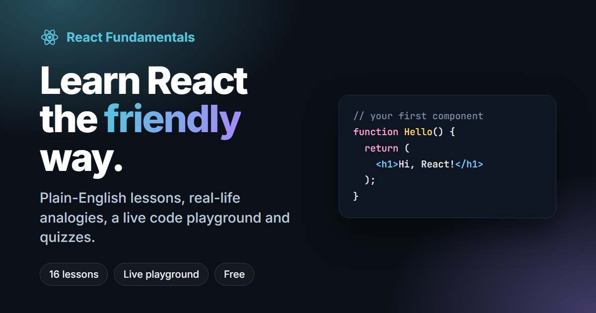

# React Fundamentals — A Beginner-Friendly Learning Kit

Learn React the friendly way: plain-English lessons, real-life analogies, a live code playground, quizzes and real project structure.

**Live site:** https://ian1219.github.io/react-fundamentals/



## What's inside

| Page | What it does |
| --- | --- |
| **Home** (`index.html`) | Overview, learning path and your saved progress |
| **Lessons** (`learn.html`) | 16 lessons in 4 modules, with analogies, "do this, not that" examples, takeaways and quizzes |
| **Playground** (`playground.html`) | Edit and run real React code in the browser, with console output and shareable links |
| **Cheat Sheet** (`cheatsheet.html`) | Every core idea on one printable page |

### Lessons

1. **Getting Started:** What is React? · Setting up with Vite · Anatomy of a React project
2. **Core Concepts:** JSX · Components · Props · State · Events
3. **Building Real UIs:** Conditional rendering · Lists & keys · Forms · Sharing state
4. **Going Further:** useEffect · Styling · Organizing a real project · Mini project: Todo app

## Built with

Plain **HTML, CSS and JavaScript**. There's no build step and nothing to install.

- [Prism](https://prismjs.com/) for syntax highlighting
- React 18 and Babel Standalone (loaded only inside the playground preview)
- Inter and JetBrains Mono fonts
- Light and dark themes, a responsive layout, and progress saved in `localStorage`

## Project structure

```
react-fundamentals/
├── index.html          ← landing page
├── learn.html          ← lesson viewer
├── playground.html     ← live React editor
├── cheatsheet.html     ← quick reference
├── css/style.css       ← all styles (design tokens at the top)
├── js/
│   ├── common.js       ← theme, progress, code blocks (shared)
│   ├── lessons.js      ← ALL lesson content lives here
│   ├── learn.js        ← renders lessons, quizzes, sidebar
│   ├── playground.js   ← editor + live preview
│   ├── home.js         ← landing page learning path
│   └── cheatsheet.js   ← cheat sheet cards
└── assets/             ← favicon + social preview image
```

## Editing lessons

Every lesson is plain data in `js/lessons.js`. To change the text, fix a typo or add a lesson, edit that file. You don't need to touch any HTML. The comment at the top of the file lists the available block types (`p`, `code`, `tip`, `compare`, `tree`, …).

## Run locally

Open `index.html` in a browser, or use a local server for the most accurate result:

```bash
npx serve .
```

## Publish on GitHub Pages

1. Push this repository to GitHub.
2. Go to **Settings → Pages**.
3. Under **Build and deployment**, choose **Deploy from a branch**, then pick `main` and `/ (root)`.
4. Save. After a minute your site is live at `https://<your-username>.github.io/react-fundamentals/`.

---

Made for learning. Not affiliated with Meta or the React team. For the full reference, see [react.dev](https://react.dev).
